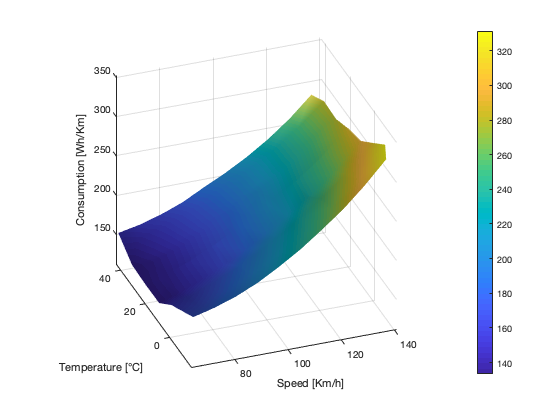
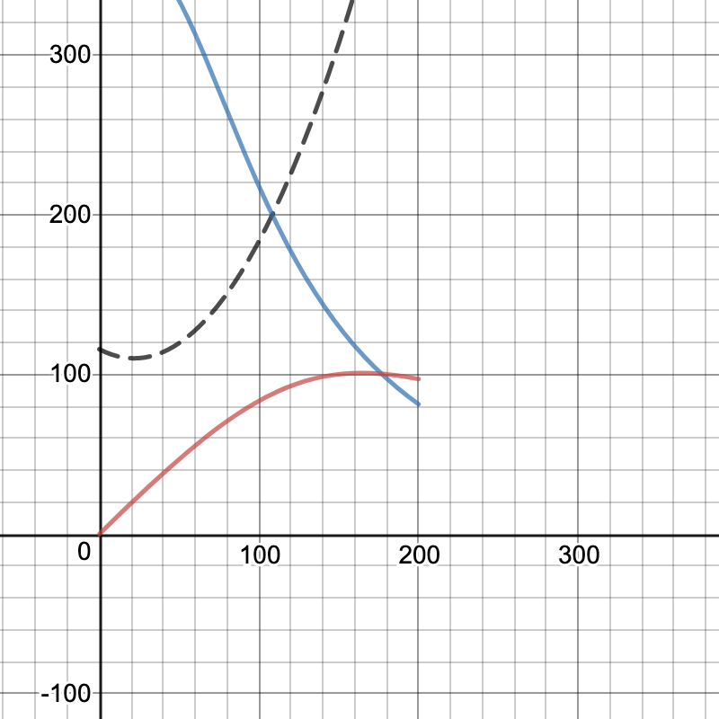

A year ago I happened to stumble on interesting data about Tesla vehicles consumption in relation to speed and temperature. I decided to reveal the data!

# Tesla Consumption Data based on Speed and Temperature

A matlab script to generate a cool graph to visualize and predict consumption data.

Based on this I created a calculator [on Desmos](https://www.desmos.com/calculator/nnccaofdub) to show the optimal cruising speed, interpolating data for higher speeds. (it's about 165 kph / 100 mph)

### Preview of the Desmos Calculator for optimal cruising speed:

## Getting Started

This project is written in Matlab, so it works in all major OSes.

Just run the program .mlx in the Tesladata folder! (with Matlab)

### Prerequisites

Install Matlab

## Files used

* teslasheet [on my Drive](https://docs.google.com/spreadsheets/d/1wCQQs4Db_8AbxcvRWW3v0yB4pYNEC7v6ckFMnnmIEE4/edit?usp=sharing) - created with [SourceFiles](SourceFiles) taken from [Tesla Motors Club Forum](https://teslamotorsclub.com/tmc/threads/breaking-down-the-model-s-range-calculator-hidden-features-and-data.94675/#post-2692441)

## Built With

* [Sublime Text](https://www.sublimetext.com/) - The text editor used
* [Matlab](mathworks.com) - To develop initially
* [GitHub Desktop](https://desktop.github.com/) - To manage developement

## Contributing

The following is a copy of PurpleBooth
> Please read [CONTRIBUTING.md](https://gist.github.com/PurpleBooth/b24679402957c63ec426) for details on our code of conduct, and the process for submitting pull requests to us.

## Versioning

We use [SemVer](http://semver.org/) for versioning. For the versions available, see the [tags on this repository](https://github.com/cad0p/Money/tags). 

## Authors

* **Pier Carlo Cadoppi** - *Initial work*

See also the list of [contributors](https://github.com/cad0p/Money/contributors) who participated in this project.

## License

This project is licensed under the MIT License - see the [LICENSE.md](LICENSE.md) file for details

## Acknowledgments

* Hat tip to anyone whose code was used
*  * **Billie Thompson** - *README Template* - [PurpleBooth](https://github.com/PurpleBooth)
* Inspiration
* etc lol
